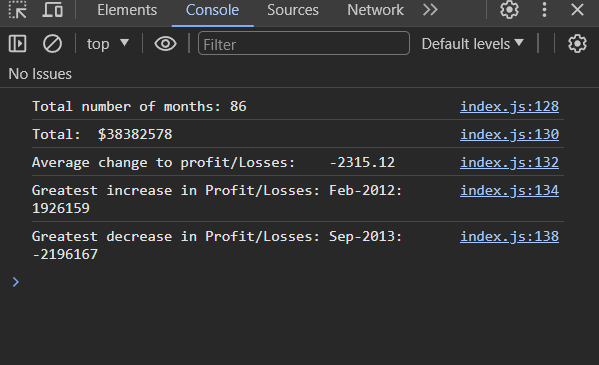

# Console Finances

## Description

This programme analyses the profit/losses over an 86 month period outputting useful information including greatest increase/decrease to profit/losses.

## Example Output

## Credits

Received help from AskBCS assistant where the following two changes were made:

- change was calculated from index 1 onwards instead of 0

- average was calculated to 2 decimal places
