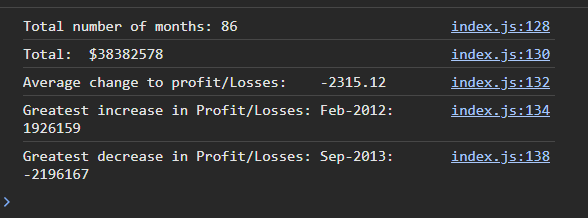

# M4 Challenge

## Description

A programme that prints analysis of a hard coded data set of dates and profits/losses

## Screenshot

## credits

asked for help on Ask BCS in order to get accurate average result and to round to 2 dp.
